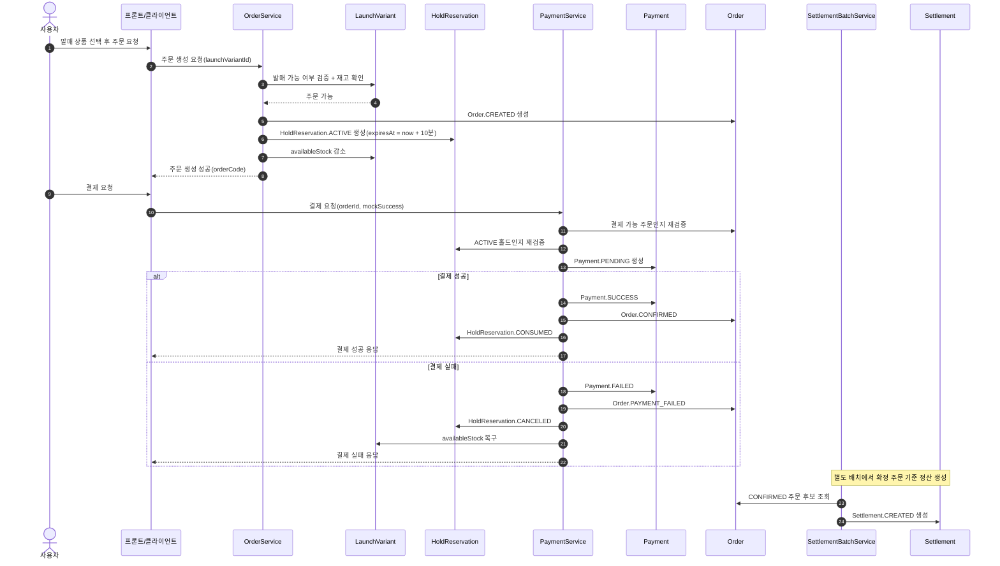
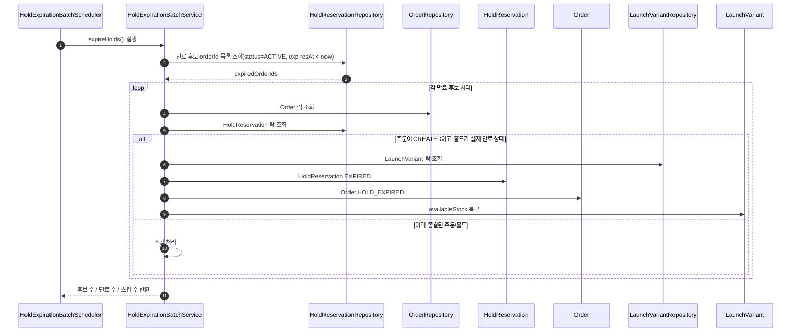

# DDIBS Sequence Diagrams

## 1. 문서 목적

이 문서는 DDIBS의 핵심 플로우를 Mermaid 시퀀스 다이어그램으로 정리한 문서다.

DDIBS는 일반적인 쇼핑몰이 아니라, 한정 수량 상품 발매 상황에서
**주문 생성 시 재고 홀드**, **홀드 만료 시 자동 해제 및 재고 복구**,
**결제 성공/실패에 따른 상태 전이**, **확정 주문 기준 정산 생성**
까지를 안정적으로 처리하는 백엔드 시스템이다.

따라서 다이어그램도 아래 두 흐름을 중심으로 정리한다.

1. 주문 생성 → 홀드 → 결제 → 주문 확정 → 정산 생성
2. 홀드 만료 배치 → 주문 만료 → 재고 복구

---

## 2. 플로우 1: 주문 생성 → 재고 홀드 → 결제 → 주문 확정 → 정산 생성

### 설명 포인트
- 주문 생성 시점에 홀드를 함께 만들고 재고를 즉시 감소시킨다.
- 결제 성공 시점에는 정산을 직접 생성하지 않고, 확정 주문만 만든다.
- 정산은 별도 배치가 `CONFIRMED` 주문 기준으로 생성한다.
- 결제 실패 시 재고는 즉시 복구된다.

---

## 3. 플로우 2: 홀드 만료 배치 → 자동 해제 → 주문 만료 처리 → 재고 복구

### 설명 포인트
- 홀드 만료 배치는 후보를 바로 처리하지 않고, **후보 조회 → 락 재조회 → 최신 상태 검증** 구조로 동작한다.
- 이미 결제가 끝났거나 홀드 상태가 바뀐 경우는 스킵한다.
- 실제 만료 처리 시에는 `HoldReservation.EXPIRED`, `Order.HOLD_EXPIRED`, `availableStock 복구`가 함께 일어난다.
- 결과는 단순 count가 아니라 **후보 / 실제 만료 / 스킵** 기준으로 구조화되어 운영 로그와 테스트 설명력이 좋아진다.

---

## 4. 시연 시 연결해서 설명할 포인트

### 플로우 1 설명 시
- 주문 조회 화면에서 `CREATED`, `CONFIRMED`, `PAYMENT_FAILED` 상태를 보여준다.
- 정산 조회 화면에서 `CONFIRMED` 주문 기준으로 생성된 정산을 보여준다.
- 발매/재고 조회 화면에서 재고 감소 결과를 보여준다.

### 플로우 2 설명 시
- 코드 화면에서는 배치 서비스 구조를,
- README/문서에서는 상태 전이와 복구 시나리오를,
- 테스트에서는 경합과 복구 검증을 함께 설명한다.

---

## 5. 한 줄 결론

DDIBS의 시퀀스 다이어그램은 단순 주문/결제 흐름이 아니라,
**고수요 발매 상황에서 재고 홀드, 만료 해제, 결제 상태 전이, 정산 생성이 어떻게 연결되는지**
를 한눈에 보여주기 위한 문서다.
